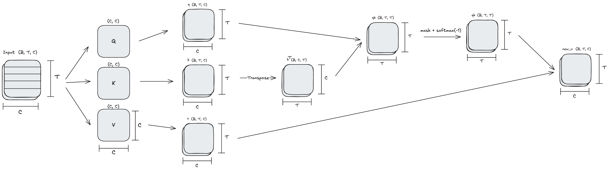

# RemarqueGPT

## Dataset 
| Title (EN)                  | Title (RU)                        | Alt Title (RU)            | Year | Translations                                                                 |
|-----------------------------|-----------------------------------|---------------------------|------|------------------------------------------------------------------------------|
| The Dream Room              | Приют грёз                        | Мансарда снов             | 1920 | 1. Г. А. Левина 2. «Медикус» (1991) 3. Е. Е. Михелевич «Вагриус» (2000)|
| Station at the Horizon      | Станция на горизонте              |                           | 1928 | 1. «Вагриус» 2. «АСТ» Серафима Шлапоберская                               |
| All Quiet on the Western Front | На Западном фронте без перемен | На Западе без перемен     | 1929 | 1. «АСТ» Федорова Н. 2. Юрий Николаевич Афонькин                          |
| The Road Back               | Возвращение                       |                           | 1931 |                                                                              |
|                             | Три товарища                      |                           | 1936 |                                                                              |
|                             | Возлюби ближнего своего           |                           | 1941 |                                                                              |
|                             | Триумфальная арка                 |                           | 1945 |                                                                              |
|                             | Искра жизни                       |                           | 1952 |                                                                              |
|                             | Время жить и время умирать        |                           | 1954 |                                                                              |
|                             | Чёрный обелиск                    |                           | 1956 |                                                                              |
|                             | Жизнь взаймы                      |                           | 1961 |                                                                              |
|                             | Ночь в Лиссабоне                  |                           | 1962 |                                                                              |
|                             | Тени в раю                        |                           | 1971 |                                                                              |
|                             | Гэм                               |                           | 1998 |                                                                              |
|                             | Земля обетованная                 |                           | 1998 |                                                                              |

# Implementation details

## Single Head Attention Graph
